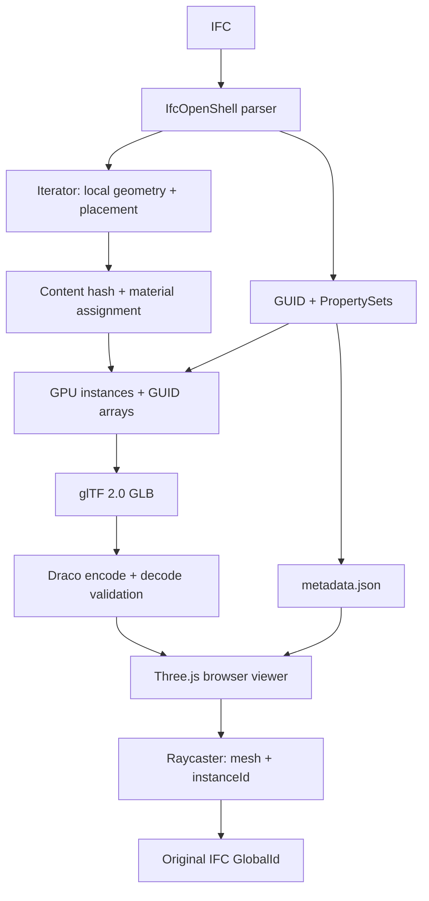

# Контур 2 — технический прототип Спринта 0

Рабочий конвертер IFC → instanced GLB → Draco и лёгкий TypeScript viewer. В архиве есть исходный КМ IFC, результаты реальной конвертации, исходный код, собранный viewer, тесты и отчёты.

**Граница подтверждения:** конвертация КМ, GUID round-trip, Three.js GLTFLoader/Raycaster в Node и карантин проверены запуском. Браузерная визуализация, GPU FPS и полная задержка UI здесь не подтверждены: доступный браузер блокировал локальный стенд (`ERR_BLOCKED_BY_CLIENT`). Полная Definition of Done и приёмка по ТЗ не объявляются выполненными. Факты — в `SPRINT0_PROTOCOL.md` и двух протоколах гипотез.

## Быстрый просмотр готовой модели

Для уже собранного viewer достаточно Python 3.11+:

```bash
cd kontur2
python3 scripts/serve.py
```

Откройте `http://127.0.0.1:8080/?model=/models/km/model.glb`.

Маленькая модель: `http://127.0.0.1:8080/?model=/models/small/model.glb`.

Статический сервер отдаёт `viewer/dist`, результаты из `reports` доступны под `/models/`, Draco decoder — `/draco/`. Сервер выполняет только HTTP-отдачу и запись JSON benchmark. Конвертация всегда выполняется отдельным CLI/worker. Для открытия на другом компьютере стенда предусмотрен `--host 0.0.0.0`.

## Полная установка и воспроизведение

Проверенная платформа — Linux x86_64, Python 3.12, Node.js 24. Требуются Python ≥3.11, Node.js ≥22.18, npm, make и доступ к PyPI/npm. Windows: WSL2. Метрика RSS использует Linux `resource.ru_maxrss`. Потребление памяти проверенного КМ-прогона указано в протоколе; оно не является лимитом worker.

```bash
make setup
make test
make convert FILE=fixtures/km.ifc OUT=reports/km WORKERS=4
make validate
make viewer
```

`make setup` создаёт `.venv`, устанавливает Python-зависимости и точные npm lockfiles, копирует локальный Draco decoder и собирает viewer. Исходный `fixtures/km.ifc` идентичен вложенной пользователем КМ-модели по SHA-256; имена исходных трёх моделей перечислены в `reports/input-inventory.json`.

Без make, после установки зависимостей:

```bash
.venv/bin/python -m converter fixtures/km.ifc --output reports/km \
  --workers 4 --draco --draco-level 7 --metadata --validate --report --timeout 2400
```

`--no-draco` и `--no-metadata` отключают соответствующие необязательные этапы. Валидация и отчёты обязательны; флаги `--validate` и `--report` документируют включённое поведение. Любая потеря GUID, ошибка геометрии или валидации даёт ненулевой exit code и карантин. `--draco-level` — сложность кодирования 0–10; позиционная точность фиксирована на 16 бит на геометрию.

Независимая проверка повторно открывает IFC и сравнивает его объекты с manifest и GLB:

```bash
.venv/bin/python -m scripts.validate_output fixtures/km.ifc reports/km
node scripts/verify-three.mjs reports/km/model.decoded.glb reports/three-km-report.json
node scripts/measure-raycast.mjs reports/km/model.decoded.glb
```

Первый CLI также выполняет validation автоматически. `model.decoded.glb` — независимое декодирование Draco через glTF Transform для проверки чисел и загрузки в Node; в браузер передаётся `model.glb` с Draco.

## Архитектура



- `converter/`: извлечение, материалы, assembly, безопасные свойства, GLB, независимая валидация.
- `worker/`: subprocess, timeout, коды завершения, сигналы, последовательная очередь и карантин.
- `viewer/`: strict TypeScript, Vite, Three.js, OrbitControls, GLTFLoader, DRACOLoader.
- `scripts/`: HTTP-сервер, Draco, synthetic IFC, acceptance и benchmark runner.
- `tests/`: Python unit/integration и JavaScript mapping tests.
- `reports/`: фактические результаты; `fixtures/`: воспроизводимые входы.

## Геометрия, координаты и идентичность

Кандидаты выбираются из `IfcProduct`, без списка только «разрешённых» физических классов. Пространственные контейнеры, отверстия/voids, аннотации, сетки и продукты без body representation имеют явные причины исключения. Для кандидата, который не вернул геометрию, результат — FAIL. Основные геометрические контексты iterator — `Body` и `Facetation`; неподдержанная геометрия приводит к FAIL и карантину.

Используется локальная геометрия IfcOpenShell в метрах и его фактическая матрица размещения в метрах, `convert-back-units=false`. Единицы IFC фиксируются отдельно. Независимая выборка сверяется с `use-world-coords=true`. Корневой узел GLB переводит Z-up в Y-up и сохраняет общий сдвиг модели. Поэтому координаты совместимы между фрагментами в одной исходной инженерной системе. Географические CRS/IfcMapConversion между разными системами координат не унифицируются; отдельный реальный многофрагментный acceptance не выполнен.

Локальные POSITION, индексы, назначения материалов и цвета входят в SHA-256. Матрица не входит в hash. Применение `float32` соответствует GPU-представлению; это не геометрический tolerance-based merge. `geometry.id` не используется как доказательство равенства. Отрицательный determinant обрабатывается отражением локальной формы и winding; instancing-матрица имеет положительный determinant. Непредставимый в TRS shear запекается в локальную форму и регистрируется.

`node.extras.ifc` содержит `geometryKey`, `instanceGuids`, `instanceExpressIds`, `instanceTypes`. Индекс каждого массива строго соответствует GPU `instanceId`. Несколько material primitives имеют общий mapping логической группы: они не считаются отдельными IFC-элементами. GLB достаточно для определения GlobalId без sidecar.

Контейнерные assembly без representation исключаются. Assembly с собственной геометрией сохраняются. При наличии геометрии и дочерних элементов сравниваются канонические треугольники в мировых координатах с округлением до микрометра: полное повторение подавляется с причиной, частичное совпадение даёт FAIL. Это не универсальная проверка пересечения тел с различной триангуляцией; ограничение явно остаётся. В КМ 56 контейнерных сборок и 64 сборки с собственной геометрией без дочерних тел.

Draco применяет 16-битную quantization; это сжатие с потерей точности позиций, без упрощения топологии. Число треугольников контролируется. Нормали не записываются: используется стандартная плоская отрисовка треугольников GLTFLoader. Текстуры, IFC indexed colour maps и декоративные surface styles не входят в этот PoC; цвета/прозрачность материалов, возвращённые tessellator, сохраняются.

## Viewer

Поддержаны HTTP `?model=/models/km/model.glb`, автоматический поиск соседнего `metadata.json` и drag-and-drop GLB с JSON. IFC-поля выводятся через `textContent`. Есть resize, progress, выбор, одиночная подсветка, `Isolate selected`, `Hide selected`, `Fit selected`, `Copy GUID`. Кнопка `Вся модель` объединяет Show all и fit: возвращает скрытые/изолированные элементы и общий вид модели по диагонали сверху.

Подсветка использует только один экземпляр выбранного элемента на каждый его material primitive; исходная группа не перекрашивается. При скрытии сохраняется индекс instance, матрица обнуляется, `Вся модель` восстанавливает исходные матрицы. Геометрия подсветки переиспользуется. Повторная загрузка освобождает геометрию, материалы, текстуры и Draco workers; обработчики страницы устанавливаются один раз.

## Benchmark и браузерная проверка

Откройте:

```text
http://127.0.0.1:8080/?model=/models/km/model.glb&benchmark=1&cold=1
```

После прогрева 3 с выполняется орбита минимум 10 с, пять raycast-попыток, до 100 операций выбора и isolate/show. Экран должен содержать реальную модель; в JSON сохраняются число треугольников и draw calls каждого измеренного кадра. Отчёт появляется в UI, доступен кнопкой скачивания и автоматически сохраняется сервером в `reports/browser/`. `&download=1` также запускает скачивание JSON. `cold=1` включает `fetch(..., cache: 'no-store')`; это не очистка всего кэша браузера/ОС. Decoder и приложения могут оставаться в кэше.

Для автоматического браузерного acceptance запустите сервер в одном терминале, затем:

```bash
make benchmark
```

Runner сначала проверяет два разных экземпляра маленькой модели реальными pointer events, isolate/hide/show, orbit/zoom, screenshots и console errors, затем выполняет benchmark КМ. **Этот runner здесь IMPLEMENTED_NOT_RUN:** доступный Browser отклонил оба локальных адреса. В `reports/browser-attempt.json` зафиксирована неудачная попытка открыть страницу.

Overlay: FPS current/rolling/min, frame p50/p95, draw calls, triangles, geometries, textures, JS heap при доступности, raycast/select/isolate/show. Download, GLB parse (включая Draco), время запросов декодирования и первый CPU render submit сохраняются раздельно. Decoder request timings перекрываются и не суммируются как wall time. Отдельный GPU upload timer отсутствует и записывается `null`. UI latency — начало события/операции до двух завершённых render frames, а не доказанный timestamp compositor presentation.

UI thresholds: ≤400 мс PASS; >400–800 мс PASS_WITH_LIMITATIONS; >800 мс FAIL. FPS ≥30/≥60 применяются только к согласованным моделям «Максимум»/«Средний» на эталонном Core i3, 16 GB DDR4, integrated graphics. Прототип всегда маркирует автоматический отчёт `REFERENCE_HARDWARE_NOT_USED`; автоматическое определение соответствия ПК не реализовано. Отнесение результатов к официальной приёмке требует отдельного протокола идентифицированного ПК.

## Карантин

```bash
.venv/bin/python -m scripts.queue_scenario
.venv/bin/python -m worker.queue fixtures/small.ifc fixtures/broken.ifc fixtures/small.ifc -o reports/my-queue
```

Worker получает аргументы без shell, пишет в отдельный staging-каталог и публикует результат только после завершения. Неудачный запуск не оставляет старый успешный GLB под тем же выходным именем. Timeout завершает группу процессов, включая Draco. `quarantine.json` хранит имя/путь входа, UTC timestamp, stage, exception, exit code, signal и stderr tail. Исходный IFC не перемещается и не удаляется. SIGKILL без timeout отмечается как *возможный* OOM; это не доказательство OOM. Очередь продолжает следующие jobs. Это последовательная CLI-очередь PoC, без БД, многопользовательского job API и восстановления незавершённых jobs после перезапуска сервиса.

## Отчёты и ограничения приёмки

`reports/km/`: `conversion-report.json`, `validation-report.json`, `guid-roundtrip-report.json`, `independent-validation-report.json`, `source-manifest.json`, `model.validator.json`, metadata и три версии GLB. Стандартный glTF Validator не проверяет внутреннюю семантику EXT_mesh_gpu_instancing и Draco; для них выполнены собственный decode/round-trip и GLTFLoader tests.

В исходном архиве 3 IFC, не требуемые ТЗ 19. Реальный acceptance выполнен только для КМ; КЖ/КР зарегистрированы в inventory. Нагрузочные сценарии API/PostgreSQL/object storage/параллельных пользователей, длительный soak, эталонный ПК, реальное совмещение фрагментов и согласование классификации ошибок сторонами не выполнены. Наличие исходного кода не означает приёмку этих пунктов.

Документация используемых форматов и библиотек:

- [IfcOpenShell geometry settings](https://docs.ifcopenshell.org/ifcopenshell/geometry_settings.html)
- [IfcOpenShell geometry iterator](https://docs.ifcopenshell.org/ifcopenshell/geometry_iterator.html)
- [glTF Transform](https://gltf-transform.dev/)
 
